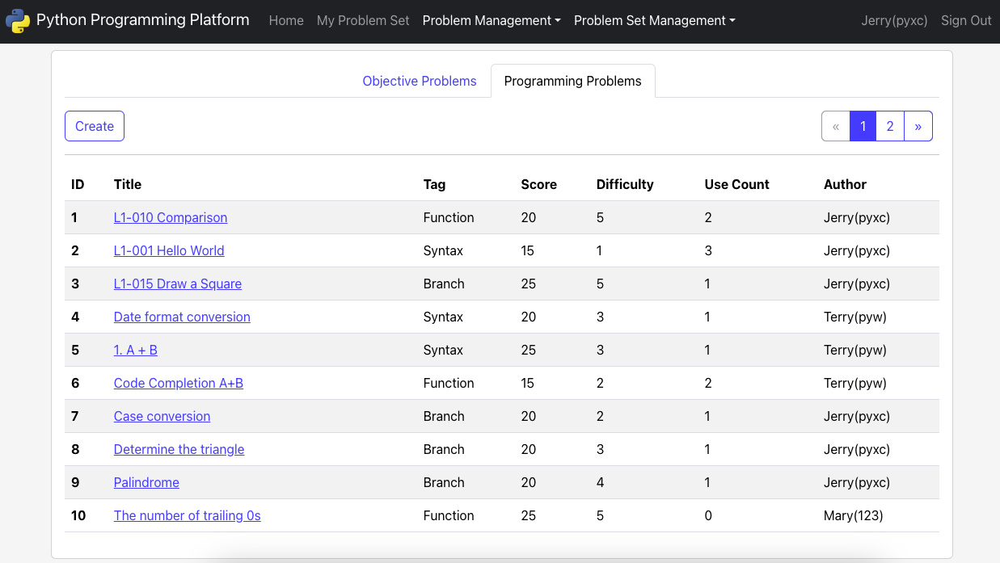
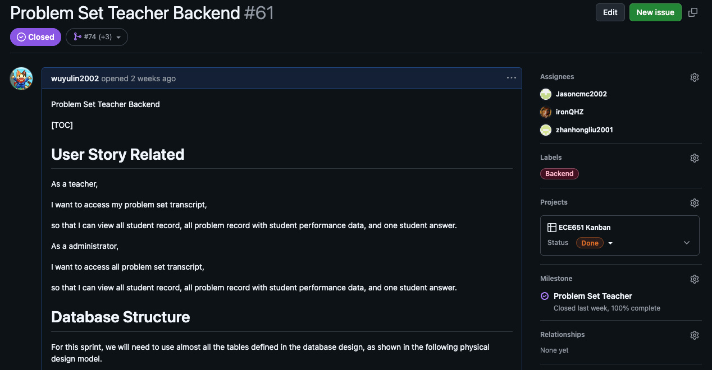
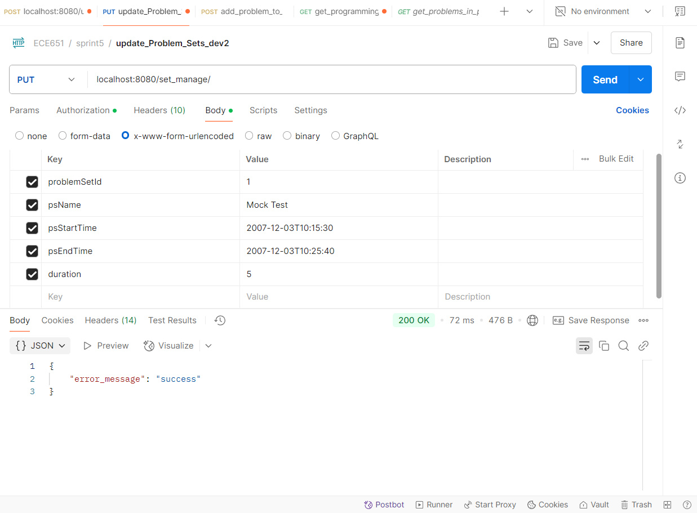

# ECE651: PYTHON ONLINE PROGRAMMING PLATFORM

## 1. PROJECT OVERVIEW

Our project enables educators to create problem sets of coding assignments (in Python) or exams with objective problems and programming problems. Students submit their Python code right on the site; the system runs it in a secure sandbox and instantly returns the output. The application will automatically grade students’ answers and collect students’ performance data for each problem set, meeting the needs of Python education in many aspects.

We manage the code on GitHub and following agile practices — iterative sprints, pull-request reviews, automated testing, and regular deployments.

## 2. PROJECT ARCHITECTURE

The project uses a **React** front end, with Router/Service layers and add-ons like *Bootstrap, Redux, react-router-dom, CodeMirror, react-markdown, SheetJS, react-countdown*, and **jQuery** to make the HTTP requests. Those requests hit a **Spring Boot** back end that exposes **RESTful** endpoints. Data is persisted through **MyBatis-Plus** to a **MySQL** database. We use *Lombok* to trim boilerplate, **JWT** to handle secure requests, and a **Jython** sandbox to run Python scripts securely.

## 3. PROJECT DEMO
- Some screenshots of our project: 

- YouTube link to the demo of our project: <a href="https://www.youtube.com/watch?v=2cjOvgZCeMo">Link</a>

## 4 SOFTWARE DEVELOPMENT PRACTICE
- [4.1 Requirement Analysis](#41-requirement-analysis)
- [4.2 System Design](#42-system-design)
- [4.3 Version Control](#43-version-control)
- [4.4 Agile Methodology](#44-agile-methodology)
- [4.5 Testing](#45-testing)
- [4.6 Pull Requests](#46-pull-requests)
### 4.1 REQUIREMENT ANALYSIS

### 4.2 SYSTEM DESIGN

### 4.3 VERSION CONTROL
We use GitHub for source code management and project management

### 4.4 AGILE METHODOLOGY
➢ GitHub Issues

➢ User Story

➢ DB Table Structure Definition

➢ API Definition

➢ Kanban Board

### 4.5 TESTING
➢ Unit Test – Junit

➢ Unit Test – Jest

➢ API Testing – Postman

➢ UI Testing – Selenium

➢ GitHub Actions for CI and Auto Testing

### 4.6 Pull Requests

## 5 DEPLOYMENT ON AWS

➢ AWS Servers

➢ AWS Continuous Deployment (CD)

## 6 DEVELOPMENT TEAM (In alphabetical order)
Mingchen Cai

Henry Qiu

Yulin Wu

Zhanhong Liu
